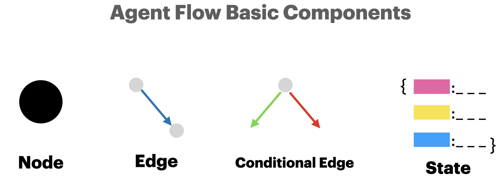

# Agent Flow with LangGraph in Action

This repository contains the code examples from the article [Agent Flow with LangGraph in Action](https://medium.com/@yingbiao/agent-flow-with-langgraph-in-action-01b7531b5ee9).

It demonstrates how to create an agent workflow using LangGraph to build a Rock Paper Scissors game where an AI agent plays against two human players.

## Getting Started

### Prerequisites

- Python 3.12
- Virtual environment (venv)

### Installation & Setup

1. Create and activate a Python 3.12 virtual environment:
```bash
python3.12 -m venv .venv
source .venv/bin/activate
```

2. Install the required packages:
```bash
pip install -r requirements_dev.txt
```

3. Set your OpenAI API key in the `.env` file:
```bash
OPENAI_API_KEY=your_api_key_here
```

4. Run the script:
```bash
python RPS_agent.py
```


